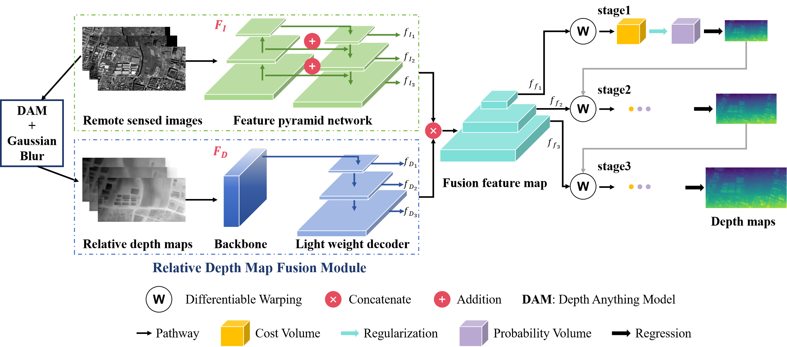

# Learning-Based Multiview Stereo for Remote Sensed Imagery With Relative Depth

The depth map estimation from a set of remote sensed images has been a challenging task due to the complexity of the real-world scenes, yet it is of great importance for applications such as 3D reconstruction and digital surface model (DSM). 
Most of the existing learning based multi-view stereo (MVS) approaches reconstruct depth map through supervised models that are trained with large amounts of data without any prior knowledge about the areas of interest. 
A recent foundational model Depth Anything, provides a robust method to estimate the relative depth map (RDM) based on single optical image. 
Leveraging its excellent performance in depth estimation and fine generalization capability, we propose a RDM fusion module that can be integrated with most state-of-the-art (SOTA) learning based MVS frameworks to improve their performance in 3D reconstruction. 
Extensive experiments are conducted to verify the effectiveness of the proposed module and positive results indicate that the integration of the proposed module leads to better accuracy and completeness compared to the benchmark models.



### Requirements

For more details, please refer to environment.yaml. And You can simply import this environment from the yaml file via conda:

`conda env create -f environment.yaml`

`conda activate RDMMVS`

Some packages are list here:

| package        | version  |
| -------------- |----------|
| gdal           | 3.6.0    |
| matplotlib     | 3.7.4    |
| numpy          | 1.21.1   |
| tensorboardx   | 2.11.2   |
| pytorch        | 1.21.1   |
| torchvision    | 0.13.1   |
| numpy-groupies | 0.9.22   |
| opencv-python  | 4.9.0.80 |

### Data Preparation
The project code takes the WHU-MVS aerial dataset as an example, 
which can be downloaded from https://gpcv.whu.edu.cn/data/WHU_MVS_Stereo_dataset.html.
This dataset format can be reorganized using the script `tools/WHU-MVS_process.py` 
to generate the following file structure, except for `depthAnything` files.

```
WHU-MVS
 │  
 └─train
     ├─ image
     │    ├─ 0
     │       └─ image1.png
     │          image2.png
     │          ...        
     │    ├─ 1
     │       └─ image1.png
     │          image2.png
     │          ...   
     │      ...  
     ├─ depth
     │    ├─ 0
     │       └─ image1.pfm
     │          image2.pfm
     │          ...        
     │    ├─ 1
     │       └─ image1.pfm
     │          image2.pfm
     │          ...   
     │      ... 
     ├─ camera
     │    ├─ 0
     │       └─ image1.txt
     │          image2.txt
     │          ...        
     │    ├─ 1
     │       └─ image1.txt
     │          image2.txt
     │          ...   
     │      ... 
     ├─ depthAnything
     │    ├─ 0
     │       └─ image1.png
     │          image2.png
     │          ...        
     │    ├─ 1
     │       └─ image1.png
     │          image2.png
     │           ...   
     │      ... 
     └─test
         ...
```

The single-channel relative depth map generated by the [DapthAnything](https://github.com/LiheYoung/Depth-Anything) 
model is processed by the `tools/gaussian_blur.py` script to generate a multi-scale three-channel relative depth map. 
The `depthAnything` files of the WHU-MVS dataset suitable for model training 
can be downloaded at https://pan.baidu.com/s/1Z4B5Wyum83eVFp8C-bCTCQ?pwd=eqnp 
code: eqnp

Additionally, the WHU-TLC satellite dataset used in the paper can be downloaded from https://gpcv.whu.edu.cn/data/whu_tlc.html. 

If you use these datasets, please cite their corresponding papers.
```
@InProceedings{whu-mvs,
  author={Liu, Jin and Ji, Shunping},
  booktitle={Proc. CVPR}, 
  title={A Novel Recurrent Encoder-Decoder Structure for Large-Scale Multi-View Stereo Reconstruction From an Open Aerial Dataset}, 
  year={2020},
  pages={6049-6058},
  doi={10.1109/CVPR42600.2020.00609}}

@InProceedings{Gao_2021_ICCV, 
  author = {Gao, Jian and Liu, Jin and Ji, Shunping}, 
  title = {Rational Polynomial Camera Model Warping for Deep Learning Based Satellite Multi-View Stereo Matching}, 
  booktitle = {Proceedings of the IEEE/CVF International Conference on Computer Vision (ICCV)}, 
  month = {October}, 
  year = {2021}, 
  pages = {6148-6157} }
```
### Pretrain models
The trained weights using the WHU-MVS aerial dataset can be downloaded from https://pan.baidu.com/s/1TS9UogRQaGJSB5DHCv-D8w?pwd=8ake.
code: 8ake
### Train
Train on WHU-MVS dataset:

`python train.py --mode="train" --model="red" --geo_model="pinhole" --dataset="aerial" --dataset_root=[Your dataset root] --batch_size=1 --min_interval=[GSD(resolution of the image)] --gpu_id="0"`

### Predict
If you want to predict your own dataset, you need to If you want to predict on your own dataset, you need to first organize your dataset into a folder similar to the processed WHU-MVS dataset. And then run:

`python predict.py --model="red" --geo_model="pinhole" --dataset="aerial" --dataset_root=[Your dataset] --loadckpt=[A checkpoint]`

### Citation
If you find this work helpful, please cite our work:
```
@ARTICLE{10836181,
  author={Yu, Anzhu and Hong, Danyang and Lu, Xuanbei and Ji, Song and Fan, Junyi},
  journal={IEEE Geoscience and Remote Sensing Letters}, 
  title={Learning-Based Multiview Stereo for Remote Sensed Imagery With Relative Depth}, 
  year={2025},
  volume={22},
  pages={1-5},
  keywords={Feature extraction;Costs;Three-dimensional displays;Satellite images;Image reconstruction;Remote sensing;Accuracy;Solid modeling;Adaptation models;Satellites;3-D reconstruction;deep learning;depth map;digital surface model (DSM);multiview stereo (MVS)},
  doi={10.1109/LGRS.2025.3527550}}
```
### Acknowledgements
Thanks to the authors of Depth Anything, SatMVS, UCS-Net, Cas-MVSNet, and VisSat (adapted COLMAP) for open sourcing their fantastic projects. You may want to visit these projects at:

https://github.com/LiheYoung/Depth-Anything

https://github.com/WHU-GPCV/SatMVS

https://github.com/touristCheng/UCSNet

https://github.com/alibaba/cascade-stereo

https://github.com/Kai-46/VisSatSatelliteStereo

